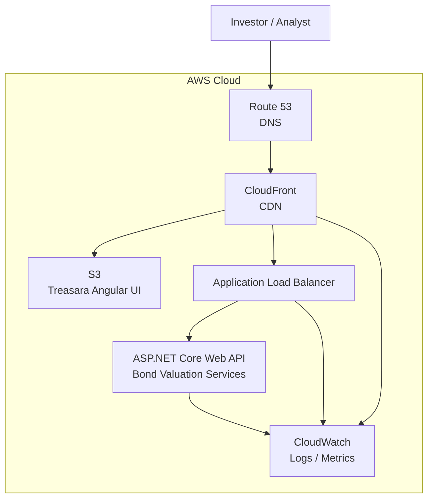
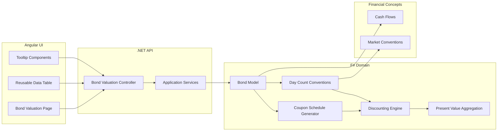
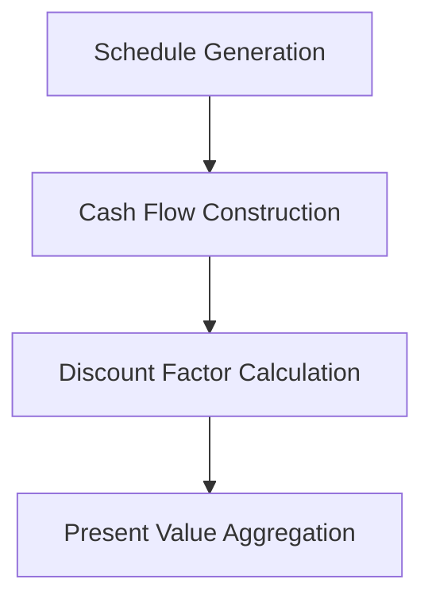

# Treasara

**Treasara** is a financial engineering sandbox for exploring fixed-income valuation concepts, domain modeling, and modern software architecture.

The project currently includes a bond valuation engine capable of generating coupon schedules, discounting cash flows, and computing present value using configurable market conventions.

Treasara is also an experiment in **domain-driven design across languages**, with the financial domain implemented in **F#**, the API layer implemented in **C# .NET**, and the user interface built with **Angular**.

---

# Demo

https://treasara.scottmckenzielewis.com/

# Demo Deployment


---

# Features

- Fixed-rate bond valuation
- Coupon schedule generation
- Discounted cash-flow valuation
- Day-count convention support
- Roll convention handling
- Interactive UI for valuation inputs
- Cash-flow breakdown table with paging
- Reusable Angular UI components
- Clean separation between domain and infrastructure

---

# Architecture

Treasara follows a layered architecture where the **financial domain logic is isolated in F#**, while surrounding layers focus on API transport and user interaction.

## System Architecture



This pipeline structure allows the financial logic to remain:

- deterministic
- composable
- easy to test

---

# Why F# for the Domain?

Treasara intentionally implements its **domain layer in F#**.

While the surrounding application stack uses **C# and TypeScript**, the financial models themselves benefit from several properties of the F# language.

## 1. Strong Domain Modeling

F# encourages modeling business concepts using:

- records
- discriminated unions
- algebraic data types

Financial concepts such as:

- coupon frequencies
- day-count conventions
- roll conventions
- instrument types

can therefore be expressed explicitly and safely.

This reduces invalid states and improves correctness.

---

## 2. Immutability by Default

Financial calculations should behave like **mathematical functions**.

F# encourages immutable data structures and pure functions, making the valuation engine:

- deterministic
- predictable
- easier to test

Given identical inputs, the engine always produces identical outputs.

---

## 3. Functional Composition

Financial calculations often form pipelines:



F# allows these pipelines to be expressed naturally using functional composition.

---

## 4. Reduced Boilerplate

Compared with traditional object-oriented code, F# requires far less structural boilerplate.

Domain code tends to read more like a **specification of financial logic**, rather than infrastructure scaffolding.

---

## 5. Excellent .NET Interoperability

F# runs on the .NET runtime and interoperates seamlessly with C#.

This allows the project to combine:

- **F# for financial logic**
- **C# for APIs and infrastructure**
- **Angular for UI**

without friction.

---

## 6. Mathematical Affinity

Functional programming languages have historically been well-suited for expressing mathematical models.

Concepts such as:

- pricing formulas
- valuation pipelines
- transformations of cash-flow streams

map naturally to functional programming patterns.

---

## 7. Intellectual Curiosity

Finally, Treasara is partly motivated by curiosity.

The project explores how a functional language like F# can improve clarity, safety, and expressiveness when modeling financial systems.

---

# Running the Project

## Start the API

```bash
cd Treasara.Api
dotnet run

cd treasara-ui
npm install
npm start
```

The UI will connect to the API and allow interactive valuation.

# Example Valuation Workflow

1. Enter bond parameters in the UI

2. Submit valuation request to the API

3. Domain layer generates coupon schedule

4. Cash flows are discounted using the supplied curve rate

5. Present value is calculated

6. Results are returned and displayed with a detailed cash flow breakdown

# Roadmap

Planned enhancements include:

- yield-to-maturity calculations

- duration and convexity

- yield curve support

- additional fixed-income instruments

- scenario analysis

- portfolio aggregation

- more advanced pricing models

# License

This project is licensed under the MIT License.

MIT License

Permission is hereby granted, free of charge, to any person obtaining a copy
of this software and associated documentation files (the "Software"), to deal
in the Software without restriction, including without limitation the rights
to use, copy, modify, merge, publish, distribute, sublicense, and/or sell
copies of the Software.

THE SOFTWARE IS PROVIDED "AS IS", WITHOUT WARRANTY OF ANY KIND,
EXPRESS OR IMPLIED, INCLUDING BUT NOT LIMITED TO THE WARRANTIES
OF MERCHANTABILITY, FITNESS FOR A PARTICULAR PURPOSE AND NONINFRINGEMENT.

IN NO EVENT SHALL THE AUTHORS OR COPYRIGHT HOLDERS BE LIABLE FOR ANY CLAIM,
DAMAGES OR OTHER LIABILITY ARISING FROM, OUT OF OR IN CONNECTION WITH THE SOFTWARE.
Disclaimer

This software is provided for educational and experimental purposes only.

It is not intended for financial advice, investment decisions, or trading purposes.

Financial markets involve significant risk. Always consult with a qualified financial professional or financial adviser before making investment decisions.

The author assumes no responsibility for financial losses or decisions made based on this software.

## Authors

- Scott McKenzie Lewis ([@ScottMcKenzieLewis](https://github.com/ScottMcKenzieLewis))
